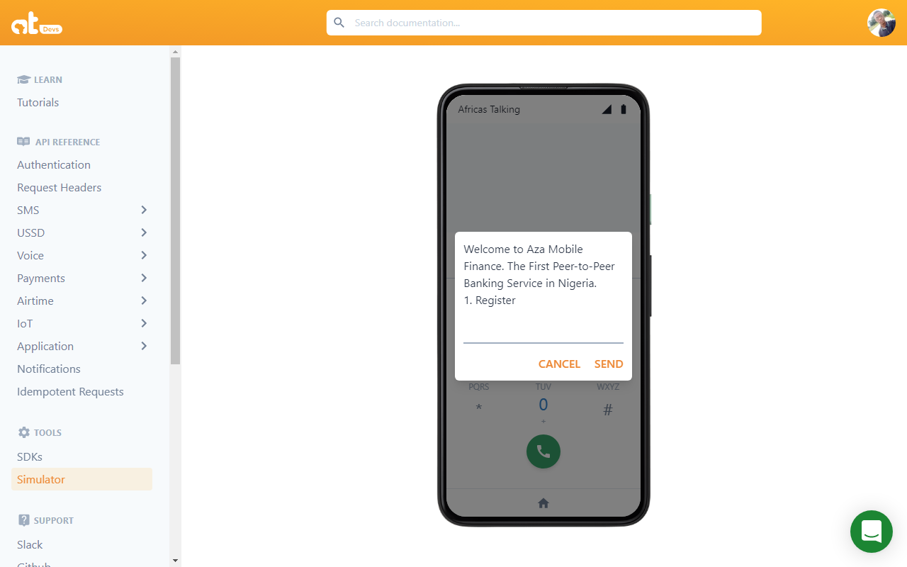
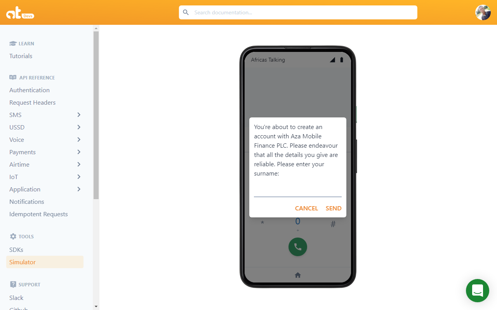
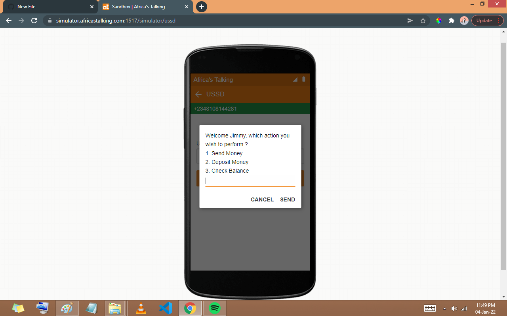

# USSD-Project 🚀

###Aza Mobile was built for a hackathon focusing on assisting the unbanked with everyday financial transactions via offering a seamless peer to peer system in order to simplify exchange 😊🚀.
